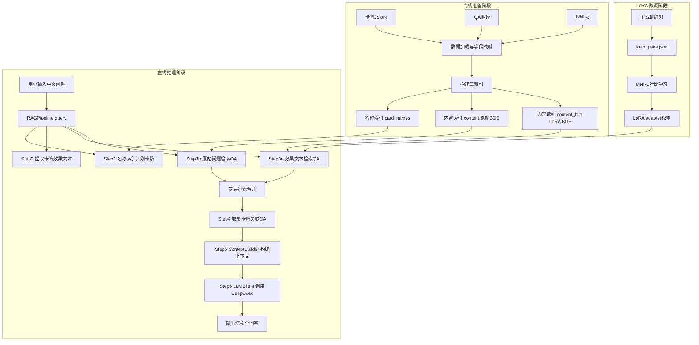
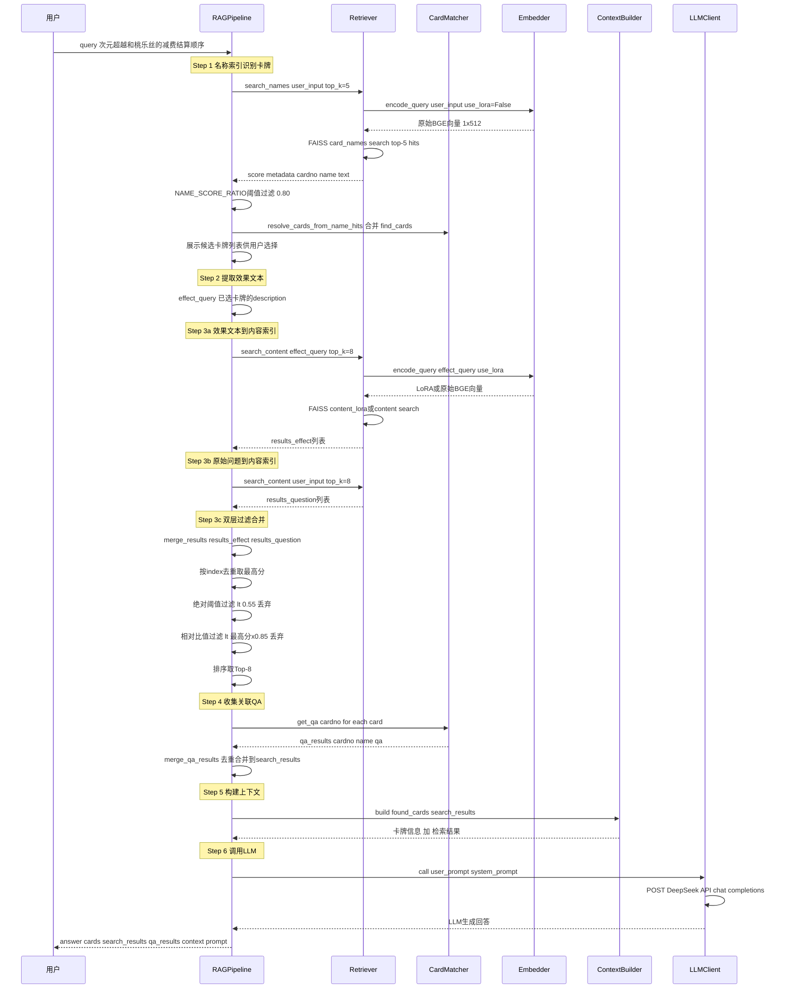
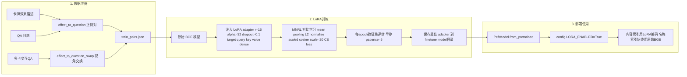

# 影之诗 EVOLVE RAG 助手 —— 完整架构解析

## 一、项目概览

这是一个面向「影之诗 EVOLVE（SVE）」卡牌游戏的 **RAG（检索增强生成）问答系统**。用户输入中文问题，系统通过向量检索找到相关的卡牌信息、Q&A 和规则书，然后交给 LLM 生成准确的中文回答。

### 技术栈

| 层次 | 技术选型 |
|------|----------|
| 嵌入模型 | `BAAI/bge-small-zh-v1.5`（33MB，中英文兼顾） |
| 微调框架 | HuggingFace Transformers + PEFT (LoRA) |
| 向量数据库 | FAISS (IndexFlatIP，内积=余弦相似度) |
| LLM | DeepSeek V4 Flash（默认）或本地 Ollama |
| Web UI | Gradio |
| 数据 | 17 个弹包卡牌 + 15 弹英文官方 Q&A（已翻译） + 完整规则书 |

---

## 二、整体架构图



---

## 三、目录结构关键文件说明

```
sve_rag/
├── data/
│   ├── loader.py              # 数据加载层（卡牌/QA/规则），所有版本共享
│   ├── cards/BP01~BP17/       # 17个弹包的卡牌数据（含中日英文）
│   ├── raw/qa_en_translated/  # 英文官方QA的中文翻译版
│   └── rules/rules_chunks.zh.json  # 规则书中文版（分块）
├── llm/
│   └── client.py              # 多后端LLM客户端（Ollama + OpenAI兼容）
├── v4/
│   ├── config.py              # 统一配置文件（所有路径/模型名/参数）
│   ├── run.py                 # 命令行入口（index / cli / ui）
│   ├── rag/                   # RAG核心模块
│   │   ├── embedder.py        # 双模型Embedding管理（原始BGE + LoRA BGE）
│   │   ├── retriever.py       # FAISS三索引加载与向量搜索
│   │   ├── card_matcher.py    # 卡牌4级匹配识别
│   │   ├── context.py         # LLM上下文构建
│   │   ├── llm_client.py      # v4版LLM适配器
│   │   └── pipeline.py        # RAG总编排（6步流程）
│   ├── indexer/
│   │   └── build.py           # 索引构建（文本→向量→FAISS）
│   ├── finetune/              # LoRA微调模块
│   │   ├── prepare_data.py    # 训练数据准备（正例对+负样本挖掘）
│   │   ├── train_embedder.py  # LoRA训练脚本（手写MNRL）
│   │   ├── eval_embedder.py   # 评估脚本（Recall@K / MRR / A/B对比）
│   │   ├── data/train_pairs.json  # 训练样本对
│   │   └── model/             # 保存的LoRA adapter权重
│   └── index/                 # FAISS索引文件目录
│       ├── card_names.faiss   # 名称索引（原始BGE）
│       ├── content.faiss      # 内容索引（原始BGE）
│       └── content_lora.faiss # 内容索引（LoRA BGE）
└── ui/
    └── app.py                 # Gradio Web界面（两步交互+多Tab展示）
```

---

## 四、RAG 完整流程 —— 逐步详解

### 前置条件：构建索引（`python run.py index`）

####  Step 0-1：加载数据

**模块**：`data/loader.py`

| 步骤 | 说明 |
|------|------|
| `load_cards()` | 扫描 `data/cards/BP01~BP17/`，读取每个弹包的 `*_all_cards.json`，过滤只保留纯数字编号普通卡（排除 SL/U/T 等异画卡），调用 `map_card_field()` 做字段映射 |
| `load_qa_cn()` | 扫描 `data/raw/qa_en_translated/BP*_qa.json`，通过卡名匹配将英文QA编号映射到中文卡牌编号，返回 `{cardno → [QA列表]}` |
| `load_rules()` | 加载 `data/rules/rules_chunks.zh.json`，返回规则块列表 |

**输入**：磁盘上的 JSON 文件  
**输出**：
- `cards`: `list[dict]` — 如 `[{cardno:"BP01-001", name:"玫瑰皇后", description:"《入场曲》...", ...}, ...]`
- `qa_data`: `dict[str, list[dict]]` — 如 `{"BP01-001": [{question_cn:"...", answer_cn:"...", card_name:"玫瑰皇后"}, ...]}`
- `rules`: `list[dict]` — 如 `[{text:"规则内容...", chapter:"1", section:"1", chunk_id:"rule-1"}, ...]`

####  Step 0-2：构建三索引

**模块**：`v4/indexer/build.py`

##### 名称索引 `card_names`

**文本准备**（[`_prepare_name_texts()`](v4/indexer/build.py:33)）：
```
输入: cards (所有卡牌)
文本: "{卡牌中文名} ({编号})"   例: "玫瑰皇后 (BP01-001)"
meta: {type:"card", cardno:"BP01-001", name:"玫瑰皇后", source:"card_name"}
```

**编码与保存**：
```
调用 encode_texts(texts, use_lora=False)  →  原始 BGE 编码
→  L2 归一化  →  FAISS IndexFlatIP.add()
→  保存为 card_names.faiss + card_names_meta.pkl + card_names_texts.pkl
```

##### 内容索引 `content` 和 `content_lora`

**文本准备**（[`_prepare_content_texts()`](v4/indexer/build.py:65)）：
```
输入: qa_data + rules
文本 (QA条目):  "问: {question_cn}\n答: {answer_cn}"    ← 注意：不包含卡牌名前缀！
文本 (规则条目): 直接使用规则的 text 字段
meta: {type:"qa"|"rule", cardno:"...", name:"...", source:"qa_cn"|"rule"}
```

**编码与保存（两份）**：
```
编码1: encode_texts(texts, use_lora=False)  →  原始 BGE  →  content.faiss
编码2: encode_texts(texts, use_lora=True)   →  LoRA BGE  →  content_lora.faiss
```

**关键设计**：`content` 和 `content_lora` 使用**完全相同的文本数据**，但用**不同的编码器**。QA 条目去掉了卡牌名前缀，避免名称污染向量，让相似度真正反映「效果/问题」的语义关联。

---

### 在线推理：`pipeline.query(user_input)`

**入口**：用户通过 CLI（`python run.py cli`）或 Web UI 输入问题  
**核心模块**：[`v4/rag/pipeline.py`](v4/rag/pipeline.py)



---

## 五、各步骤详细输入/输出

### Step 1：名称索引识别卡牌（[`identify_cards()`](v4/rag/pipeline.py:96)）

```
子步骤 A: 向量检索
  输入:  "次元超越的费用变化和桃乐丝的减费结算顺序是什么样的"
  编码:  encode_query(user_input, use_lora=False)  → 原始BGE向量 [1, 512]
  检索:  FAISS.card_names.search(向量, k=5)
  输出:  [{score:0.92, metadata:{cardno:"BP11-077", name:"次元超越"}, text:"次元超越 (BP11-077)"},
          {score:0.88, metadata:{cardno:"BP02-045", name:"次元魔女·桃乐丝"}, text:"..."},
          ...]

子步骤 B: 分数阈值过滤
  规则:  仅保留 score ≥ 最高分 × NAME_SCORE_RATIO_THRESHOLD (0.80)
  计算:  0.92 × 0.80 = 0.736
  过滤后: 所有 score ≥ 0.736 的保留

子步骤 C: 补全卡牌数据
  通过 card_matcher.card_map 按 cardno 获取完整卡牌详情
  合并 CardMatcher.find_cards() 的精确匹配结果

最终输出:
  [{cardno:"BP11-077", name:"次元超越", description:"《消费...》", 
    card_type:"Spell", class:"Witch", cost:18, ...},
   {cardno:"BP02-045", name:"次元魔女·桃乐丝", description:"...", ...}]
```

### Step 2：提取效果文本

```
输入:  found_cards (Step 1 的输出)
处理:  逐个取出 card['description']，用换行拼接
输出:  effect_query = 
       "《消费...》减少费用的卡牌...(次元超越的效果)\n
        《入场曲》...(桃乐丝的效果)"
```

### Step 3a：效果文本检索内容索引

```
输入:  effect_query (Step 2 的输出)
编码:  encode_query(effect_query, use_lora=config.LORA_ENABLED)
       → LoRA BGE向量 [1, 512]  (LORA_ENABLED=True)
       → 原始BGE向量 [1, 512]   (LORA_ENABLED=False)
检索:  FAISS.content_lora.search() 或 FAISS.content.search()
输出:  results_effect = [{score:0.66, index:5, text:"问: ... 答: ...", 
                          metadata:{type:"qa", cardno:"BP11-077", source:"qa_cn"}},
                         ...]
       (最多8条)
```

### Step 3b：原始问题检索内容索引

```
输入:  user_input (原始用户问题)
编码:  同样是根据 LORA_ENABLED 选择编码器
检索:  同上
输出:  results_question = [{score:0.60, index:100, ...}, ...]
       (可能包含噪声，因为原始问题没有在LoRA训练中见过)
```

### Step 3c：双层过滤合并（[`_merge_results()`](v4/rag/pipeline.py:33)）

```
第一层: 按 index 去重，同index取最高分
  合并 results_effect + results_question → merged = {index → 最高分记录}

第二层: 绝对阈值过滤
  丢弃 score < CONTENT_SCORE_MIN_THRESHOLD (0.55) 的结果

第三层: 相对比值过滤
  max_score = 所有合并结果中的最高分
  ratio_threshold = max_score × CONTENT_SCORE_RATIO_THRESHOLD (0.85)
  丢弃 score < ratio_threshold 的结果

第四层: 按 score 降序排序，取 Top-K (8条)

设计理由: 当LoRA把所有分数挤到狭窄区间(如0.60~0.66)时，
         相对比值过滤能有效拉大区分度，过滤掉中等分噪声
```

### Step 4：收集关联QA（[`get_qa()`](v4/rag/card_matcher.py:124)）

```
输入:  found_cards 中每张卡的 cardno
处理:  从 CardMatcher.qa_data[cardno] 获取该卡的所有中文QA
       (如无则通过卡名回退查找基础卡QA)
输出:  qa_results = [{cardno:"BP11-077", name:"次元超越", 
                       qa:{question_cn:"...", answer_cn:"..."}},
                     ...]

然后 _merge_qa_results() 将关联QA合并到 search_results 中：
  - 以 (cardno, question) 去重
  - 向量检索已有的优先保留（有相似度分数）
  - 新增的QA追加到末尾（score=None, index=-1）
```

### Step 5：构建上下文（[`context.py`](v4/rag/context.py)）

```
输入:  found_cards + search_results
输出模板:
  === 卡牌信息 ===
  卡牌: 次元超越 (BP11-077)
  职业: Witch | 类型: Spell | 费用: 18 | 攻:  | 命: 
  效果: 《消费...》减少费用的卡牌...
  
  卡牌: 次元魔女·桃乐丝 (BP02-045)
  职业: Witch | 类型: Follower | 费用: 4 | 攻: 3 | 命: 4
  效果: 《入场曲》...
  
  === 检索到的相关规则和 QA ===
  [QA] 次元超越 (BP11-077)
  问: 次元超越的费用如何变化？
  答: ...
  ---
  [规则] Ch.10 Sec.5
  规则文本...
  ---
```

### Step 6：调用LLM生成回答（[`llm_client.py`](v4/rag/llm_client.py)）

```
System Prompt:
  "你是一个影之诗 EVOLVE 卡牌游戏的中文规则助手。根据提供的卡牌信息和规则 Q&A 回答问题。
   用中文回答，保持准确清晰。信息不足时诚实说明。
   回答时，优先引用向量检索结果中与问题最相关的 1~3 条 Q&A，
   明确指出每条 Q&A 涉及的卡牌名称，并说明为什么这条规则适用于当前问题。"

User Prompt:
  "用户输入: 次元超越的费用变化和桃乐丝的减费结算顺序是什么样的
   识别的卡牌: 次元超越, 次元魔女·桃乐丝
  
   以下是相关的卡牌信息和规则:
   {context}
  
   请根据以上信息回答用户的问题。
   回答要求：
   1. 从上方检索结果中选出与问题最直接相关的 1~3 条 [QA] 或 [规则] 作为依据；
   2. 引用时明确指出卡牌名称和具体规则内容，并解释为什么适用于当前问题；
   3. 优先使用检索分数最高的结果，但若最高分结果明显不相关则跳过。"

LLM调用:
  POST https://api.deepseek.com/v1/chat/completions
  model: deepseek-v4-flash
  temperature: 0.3
  max_tokens: 2048

最终返回:
  {
    'answer': "根据检索到的QA和规则，次元超越的费用变化...",
    'cards': [...],
    'search_results': [...],
    'qa_results': [...],
    'context': "...",
    'prompt': "[SYSTEM]\n...\n\n[USER]\n..."
  }
```

---

## 六、LoRA 微调完整流程

### 为什么需要 LoRA？

原始 BGE 模型是通用中文嵌入模型，对「卡牌效果描述」和「Q&A 问题」之间的语义关联理解不够精准。LoRA 微调的目标是：**建立「效果文本 → QA 问题」的语义桥梁**，让「用户输入新卡牌的效果描述」能检索到「语义相关的已有 QA」。

### 整体流程图



### 6.1 数据准备（[`prepare_data.py`](v4/finetune/prepare_data.py)）

**执行命令**：`python -m v4.finetune.prepare_data --effect-only --swap-multi`

#### 生成的正例对类型

| 类型 | 含义 | Query | Document | 数量级 |
|------|------|-------|----------|--------|
| `effect_to_question` | 主卡效果→QA问题 | 卡牌效果描述 | 该卡关联的QA问题 | 每个QA一条 |
| `effect_to_question_swap` | 多卡交互视角交换 | 被提及卡的效果描述 | 同一个QA问题 | 取决于多卡交互QA数 |

#### `effect_to_question_swap` 详解

```
问题示例: "用远古精灵选择弓箭手时，是否触发进化时效果？"
  - 主卡: 弓箭手 (BP01-018)，QA 原始关联此卡
  - 被提及卡: 远古精灵 (BP01-003)

增强策略:
  原本: 弓箭手的效果 → 该QA问题  (effect_to_question 已覆盖)
  新增: 远古精灵的效果 → 同一个QA问题  (effect_to_question_swap)
  
目的: 用户输入远古精灵的效果时，也能检索到这个多卡交互QA
```

**输出**：`v4/finetune/data/train_pairs.json`

```json
[
  {
    "query": "《入场曲》选择自己EX区域的妖精类型·从者卡任意张数。使其变身为『蔷薇的猛击』卡。\n《起动》...",
    "document": "我能否通过这个从者的起动能力，回复超过我最大PP的PP？",
    "type": "effect_to_question",
    "cardno": "BP01-001",
    "card_name": "玫瑰皇后"
  },
  {
    "query": "《入场曲》将场上的其他的1张卡片放回手牌：使这张卡《攻击力》+1/《生命值》+1。",
    "document": "用远古精灵选择弓箭手时，是否触发进化时效果？",
    "type": "effect_to_question_swap",
    "cardno": "BP01-002",
    "card_name": "远古精灵",
    "orig_cardno": "BP01-018",
    "orig_card_name": "弓箭手"
  }
]
```

### 6.2 LoRA 训练（[`train_embedder.py`](v4/finetune/train_embedder.py)）

**执行命令**：`python -m v4.finetune.train_embedder`

#### 训练配置

| 超参数 | 值 | 说明 |
|--------|-----|------|
| 模型 | BAAI/bge-small-zh-v1.5 | 33MB，512维 |
| LoRA rank | 16 | 低秩矩阵的秩 |
| LoRA alpha | 32 | 缩放系数 |
| LoRA dropout | 0.1 | 防止过拟合 |
| target_modules | query, key, value, dense | 对注意力层的QKV和FFN做适配 |
| batch_size | 32 | 批次大小 |
| learning_rate | 2e-5 | AdamW 初始学习率 |
| warmup_steps | 100 | 线性预热步数 |
| weight_decay | 0.01 | L2 正则化 |
| scale | 20.0 | MNRL 温度系数 |
| val_split | 0.20 | 80/20 训练/验证划分 |
| early_stopping | patience=5 | val_loss 连续5轮不降即停 |
| max_seq_length | 256 | 最大序列长度 |
| 可训练参数 | ~0.3% | 约 7.2 万 / 2400 万 |

#### Loss 函数：Batch内自动负例 MNRL

```
Forward流程:

Step 1: Tokenize
  queries: [效果文本1, 效果文本2, ..., 效果文本32]  → Tokenizer → (B, 256)
  docs:    [QA问题1, QA问题2, ..., QA问题32]         → Tokenizer → (B, 256)

Step 2: BERT 前向
  q_out = LoRA_BERT(queries)  →  last_hidden_state (B, L, 512)
  d_out = LoRA_BERT(docs)     →  last_hidden_state (B, L, 512)

Step 3: Mean Pooling (attention-weighted)
  q_pooled = mean_pooling(q_out, attention_mask)  → (B, 512)
  d_pooled = mean_pooling(d_out, attention_mask)  → (B, 512)

Step 4: L2 Normalize
  q_norm = normalize(q_pooled, p=2, dim=1)  → 单位向量
  d_norm = normalize(d_pooled, p=2, dim=1)  → 单位向量

Step 5: Scaled Cosine Similarity
  scores = q_norm @ d_norm.T  → (B, B) 相似度矩阵
  scores = scores × 20.0      → 放大信号

Step 6: Cross Entropy
  正例: scores[i][i] — 第i个query和第i个doc是对应的正例
  负例: scores[i][j] (j≠i) — batch内其他doc自动作为负例
  labels = [0, 1, 2, ..., B-1]
  loss = CE(scores, labels)
```

#### 训练循环

```
for epoch in 1..15 (早停会提前终止):
  shuffle(train_data)
  
  for batch in train_data:
    query = batch.effect_texts
    doc = batch.qa_questions
    loss = mnrl_loss(query, doc)
    optimizer.zero_grad()
    loss.backward()
    clip_grad_norm(max_norm=1.0)
    optimizer.step()
    scheduler.step()  # linear warmup + linear decay
  
  # 验证集评估
  val_loss = evaluate(val_data)
  
  if val_loss < best_val_loss:
    save_adapter()  # 保存最佳模型
    patience_counter = 0
  else:
    patience_counter += 1
    if patience_counter >= 5:
      break  # 早停
```

#### 训练输出

```
Epoch  1/15 | train_loss: 2.8401 | val_loss: 2.7234 | gap: -0.1167 | lr: 1.98e-05
Epoch  2/15 | train_loss: 2.5123 | val_loss: 2.4891 | gap: -0.0232 | lr: 1.86e-05
...
Epoch  8/15 | train_loss: 1.8340 | val_loss: 1.8328 | gap: -0.0012 | lr: 8.42e-06 [BEST]
Epoch  9/15 | train_loss: 1.8102 | val_loss: 1.8456 | gap: +0.0354 * | lr: 6.31e-06
...
早停触发！val_loss 连续 5 轮未改善

训练完成！
  最佳 val_loss: 1.8328 (Epoch 8)
  LoRA adapter → v4/finetune/model/
```

**输出文件**：
- `v4/finetune/model/adapter_config.json` — LoRA配置
- `v4/finetune/model/adapter_model.safetensors` — LoRA权重（~28MB）

### 6.3 评估（[`eval_embedder.py`](v4/finetune/eval_embedder.py)）

**执行命令**：`python -m v4.finetune.eval_embedder --compare`

```
评估流程：
1. 加载 train_pairs.json 中的 effect_to_question 对
2. 构建文档语料库（所有唯一的 QA 问题去重）
3. 分别用 原始BGE 和 LoRA BGE 编码所有文档
4. 对每个 query 计算与所有文档的余弦相似度
5. 找正例 doc 的排名，计算 Recall@1/3/5/10 和 MRR

输出示例:
  ====================================================
    A/B 对比: 原始 BGE vs LoRA 微调
  ====================================================
    指标            原始BGE      LoRA        变化     
    -------------------------------------------------
    Recall@1       0.1234      0.2456       +99.0%
    Recall@3       0.2345      0.4567       +94.8%
    Recall@5       0.3456      0.5678       +64.3%
    Recall@10      0.4567      0.6789       +48.6%
    MRR            0.1890      0.3456       +82.9%
    平均排名       45.2        18.7         -58.6%
  ====================================================
```

### 6.4 部署使用

**启用 LoRA**：
1. 设置 `v4/config.py` 中 `LORA_ENABLED = True`
2. 运行 `python run.py cli --lora`
3. 或在 Web UI 中勾选「启用 LoRA 微调模型」复选框

**切换机制**（[`embedder.py`](v4/rag/embedder.py)）：

```
双模型架构：
  名称索引 (card_names) → 始终使用原始 BGE (get_base_embedder())
  内容索引 (content)     → LORA_ENABLED=False 时使用
  内容索引 (content_lora) → LORA_ENABLED=True 时使用

加载逻辑：
  _load_base_model(): 加载原始 BGE AutoModel
  _load_lora_model():
    if not LORA_ENABLED:
      _lora_model = _base_model  # 直接复用
    else:
      _lora_model = PeftModel.from_pretrained(_base_model, lora_dir)  # 注入LoRA

retriever.search_content():
  if LORA_ENABLED and content_lora_index exists:
    use content_lora index + LoRA BGE 编码
  else:
    use content index + 原始 BGE 编码

运行时切换 (run.py toggle_lora):
  config.LORA_ENABLED = True/False
  reload_embedder()  # 重置双模型，下次调用重新加载
```

---

## 七、关键技术设计要点

### 7.1 三索引架构

| 索引 | 编码器 | 用途 | 说明 |
|------|--------|------|------|
| `card_names` | 原始 BGE | 卡牌名称识别 | 始终不变，用原始BGE |
| `content` | 原始 BGE | 内容检索（无LoRA时） | QA + 规则 |
| `content_lora` | LoRA BGE | 内容检索（有LoRA时） | 与content同样的文本，不同编码器 |

**优势**：
- 名称索引不受 LoRA 影响，卡牌名匹配始终稳定
- 内容索引可以运行时在原始/LoRA 之间无感切换，无需重建索引
- 编码器始终与索引保持一致，无向量空间不匹配问题

### 7.2 双向量检索 + 双层过滤

```
效果文本检索 (results_effect):
  - 用LoRA训练过的路径，通常质量较高
  - 因为训练对就是「效果→QA问题」

原始问题检索 (results_question):
  - LoRA未训练过的路径，可能全是噪声
  - 但原始问题包含了效果文本中没有的语境信息

双层过滤:
  绝对阈值 (0.55): 直接丢弃极低分噪声
  相对比值 (0.85): 丢弃远低于最高分的中等分噪声
  目的: 当LoRA把分数挤到狭窄区间时，相对比值拉大区分度
```

### 7.3 卡牌识别：向量 + 精确匹配双轨

```
用户输入 → CardMatcher.find_cards()  [4级精匹配]
         → Retriever.search_names()   [向量语义匹配]
         → 合并去重（cardno为key）
         → 展示候选列表，支持用户手动筛选
```

### 7.4 数据加载的版本隔离

```
data/loader.py  →  项目级共享模块（所有版本v3/v4共用）
v4/config.py    →  v4专属配置（路径、模型、参数）
v4/index/       →  v4专属索引目录（不同版本有独立index目录）
```

### 7.5 QA 内容索引去卡名设计

```
旧版: "卡牌: 玫瑰皇后 (BP01-001)\n问: ...\n答: ..."
       → 卡牌名污染了向量，检索偏向名称匹配而非语义匹配

新版: "问: ...\n答: ..."
       → 纯效果/问题语义，不受卡名干扰
       → 卡名信息通过 metadata 和 ContextBuilder 补全
```

---

## 八、面试核心要点速查

1. **RAG 六步流程**：名称索引→效果提取→双向量检索→合并过滤→关联QA→LLM生成
2. **三索引架构**：名称索引始终用原始BGE，内容索引根据LoRA开关自动切换
3. **LoRA 训练**：效果→问题的 MNRL 对比学习，仅训练 ~0.3% 参数
4. **双层过滤**：绝对阈值 + 相对比值，有效解决 LoRA 分数集中问题
5. **双模型分离**：`get_base_embedder()` 和 `get_lora_embedder()` 各自独立，互不干扰
6. **运行时切换**：修改 `config.LORA_ENABLED` 后调用 `reload_embedder()`，无需重启
7. **去卡名索引**：内容索引中QA条目不含卡名前缀，避免名称污染向量
8. **配置集中管理**：`config.py` 单文件管理所有路径、模型、参数
